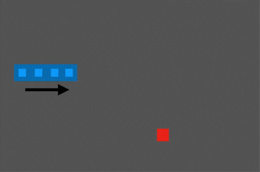

# Trainining an AI agent to play the snake game

## What is Reinforcement Learning?

```
Reinforcement learning (RL) is an area of machine learning concerned with how software agents ought to take actions in an environment in order to maximize the notion of cumulative reward. This is done by Deep Q Learning which extends reinforcement learning by using deeper neural networks to predict the actions.
```

## Components

1. **Agent**: The agent is the computer program that plays the game. It consists of:
    - Game
    - Model
    - Training
        - State = get_state(game)
        - action = get_move(state)
            - model.predict()
        - reward, game_over, score = game.play_step(action)
        - new_state = get_state(game)
        - remember (Long term memory + Short term memory)
        - model.train()

2. **Game**: The game is the environment in which the agent plays. It consists of:
    - play_step(action)
        - reward, game_over, score

3. **Model**: The model is the neural network that predicts the action. It consists of:
    - Linear_QNet(DQN)
        - action = model.predict(state)

## How are Rewards, Action, States calculated?

### Rewards
```
- eat food: +10
- game over: -10
- else: 0
```
### Actions

```python
 [1,0,0] = straight
 [0,1,0] = right turn
 [0,0,1] = left turn
```

### States

```
[danger straight, danger right, danger left, direction left, direction right, direction up, direction down, food left, food right, food up, food down]
```

For example:

<p align="center">

</p>

So the state will be:
```python
[0,0,0,0,1,0,0,0,1,0,1]
```

## Deep Q Learning

The following steps are used to train the model:

Q Value = Quality of the action

1. Init Q Value
    - Q(s,a) = 0
2. Choose action
    - epsilon-greedy
3. Perform action
    - game.play_step(action)
4. Get reward
    - reward, game_over, score
5. Update Q Value(+train model)

The learning happens by the Bellman equation:

    New Q(s,a) = Q(s,a) + alpha * (reward + gamma * max(Q(s',a')) - Q(s,a))

where alpha is the learning rate, gamma is the discount factor, and max(Q(s',a')) is the max Q value of the next state.

## Setup and usage

1. Install all the packages in the `requirements.txt` file.

```python3
pip3 install -r requirements.txt
```

2. Run `agent.py` to start the agent and training.

## Demo

<p align='center'>

</p>

The training will take about 10 minutes on CPU to get good results or high record score. The mean score increases gradually as shown in the following figure.

<p align='center'>

</p>

## License

MIT